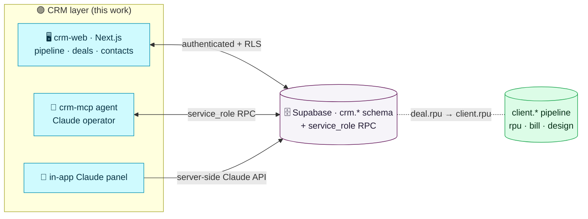
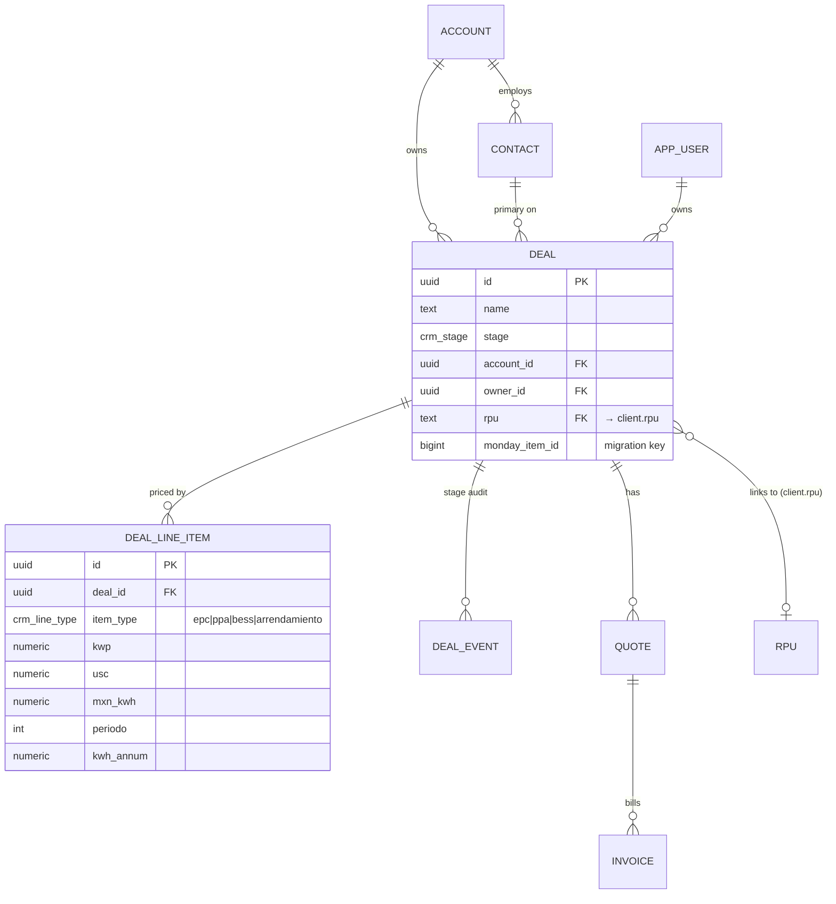
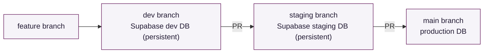

# Newman CRM — self-hosted monday.com replacement

Replace monday.com CRM Pro (4 seats, ~$1.3–1.6k/yr, <5% feature utilisation — a
static deal list with a few default automations, no sequences, no dashboards) with
a CRM owned end-to-end on the Newman platform: **Supabase schema + `service_role`
RPC contract + a Next.js app + an MCP agent**, with Claude as a first-class operator.

This is a **clean-room** rebuild, exactly like `newman-agents → newman-architecture`:
we migrate the *data* and the *workflow*, not monday's board cruft (the empty `Leads`
board and the stale Ops boards are ported as schema only).

---

## Where it fits the platform

The CRM is the **sales/relationship layer that sits in front of the existing
ingestion→design→proposal pipeline**. A CRM `deal` is the commercial wrapper around
one or more physical services (`client.rpu`), so the two schemas join rather than
duplicate:



Two access paths, matching the platform's security posture:

- **Agents / Claude MCP** use the `service_role` RPC contract only (`crm_*` functions),
  like every other agent.
- **The web app** uses Supabase Auth (`authenticated` role) with **RLS** for the 4
  human users — the one place we deliberately open a non-`service_role` path, gated by
  row-level policies.

---

## Data model · `crm` schema (ER)



The **financial model** (EPC value, VPN/NPV of contract cash flows, Flujos Contratos,
yield) is reproduced from monday's board formulas as SQL — see
`supabase/migrations/20260708110000_crm_schema.sql` (view `crm.deal_line_item_calc`)
— and must be **unit-reconciled to the cent** against monday's current outputs
before cutover.

---

## Environments — dev → staging → main (Supabase branching)

The CRM is developed under a three-environment promotion flow, isolated from the
live pipeline (**CRM-only scope**: the CFE/proposal path keeps deploying as it does
today).



- Migrations live in **`supabase/migrations/`** (not the legacy `db/migrations/`,
  which records the MCP-applied pipeline migrations). The **Supabase GitHub
  integration** applies them: each branch DB seeds from production's tracked
  migration history and then applies these on top, so **no schema baseline is
  needed** and prod is touched only on merge to `main`.
- `dev` and `staging` are **persistent** branch databases (always-on). Persistence
  is a per-branch setting in the Supabase dashboard/branch config.

---

## RPC contract (service_role)

Added to `db/rpc_contract.sql`; implemented in
`supabase/migrations/20260708110100_crm_rpc_contract.sql`.

```
crm_list_deals(p_filter jsonb)              returns setof crm.deal_summary
crm_get_deal(p_id uuid)                     returns jsonb           -- deal + line items + calc
crm_create_deal(p jsonb)                    returns uuid
crm_update_deal(p_id uuid, p jsonb)         returns void
crm_set_stage(p_id uuid, p_stage text, p_by text, p_note text) returns void
crm_upsert_line_item(p jsonb)               returns uuid
crm_pipeline_report(p_group_by text)        returns jsonb           -- counts/value by stage/owner
crm_stale_deals(p_days int)                 returns setof crm.deal_summary
crm_upsert_contact(p jsonb)                 returns uuid
crm_upsert_account(p jsonb)                 returns uuid
```

`crm_set_stage` writes a `crm.deal_event` audit row (mirrors `client.pipeline_event`).

---

## Roadmap — epics, stories, exit criteria

Delivered on the `crm-platform` branch, one epic per iteration, each a CI-green commit.
DB migrations are **version-controlled here but applied to production only behind an
explicit human checkpoint** (never auto-applied) — same rule the existing migrations
follow.

### Epic 0 — Foundation *(this iteration · Data Architect)*
- [x] Phase plan + platform-fit diagram (`docs/crm-platform.md`)
- [x] `crm` schema: accounts, contacts, deals, line items, quotes, invoices, ops,
      budgets, audit; enums; RLS scaffold (`supabase/migrations/…_crm_schema.sql`)
- [x] Financial-model view reproducing monday formulas (`crm.deal_line_item_calc`)
- [x] `service_role` RPC contract (`…_crm_rpc_contract.sql` + `rpc_contract.sql`)
- [x] Three-env branching flow (dev → staging → main) via Supabase GitHub integration
- **Exit:** schema + contract reviewed; CI green; applied to the `dev` branch DB.

### Epic 1 — Data migration *(Data Engineer)* ✅
- [x] `agents/crm-migrate/`: monday Deals board → `crm.*` upserts, idempotent on
      `monday_item_id` (`--dry-run`; needs `MONDAY_API_TOKEN`).
- [x] **167 deals + 214 line items migrated** and reconciled (non-Lead stages match
      monday exactly; null-stage deals default to lead).
- [x] `finance.py` reproduces the monday formulas; `test_finance.py` reconciles them
      **to the cent** over 47 real line items (CI green).

### Epic 2 — MCP operator agent *(Backend)* ✅
- [x] `agents/crm-mcp/`: MCP server over the `crm_*` RPC contract (list/get/create/
      set_stage/upsert/report/stale), `vault-env` + `service_role`, README + tests.
- **Exit met:** the CRM is drivable from Claude; **monday seats cancellable here.**

### Epic 3 — Web app + design system *(Frontend · UI/UX)* ✅
- [x] `apps/crm-web/` Next.js (App Router) + `@supabase/ssr` + RLS auth + middleware.
- [x] shadcn-style components themed to **Newman v3 tokens**; gradient header + wordmark.
- [x] Pipeline board (Kanban + KPIs), deals table, deal detail w/ financial model —
      reading `public.crm_pipeline` / `crm_deal_lines` under RLS. `next build` green.

### Epic 4 — In-app assistant *(Full-stack)* ✅
- [x] Server-side route (`app/api/assistant`) grounded on the live pipeline; calls
      **OpenRouter** (existing `OPENROUTER_API_KEY`), key never client-side; side-panel UI.

### Epic 5 — Cutover & decommission *(Scrum Master / Ops)*
- [x] Deploy: newman-vps behind Cloudflare Tunnel at **tuesday.newman.re** via the
      existing GitHub Actions CD (`scripts/deploy.sh` + `newman-crm-web.service`).
- [x] **Cutover runbook** — see `docs/crm-cutover.md` (delta re-migration, freeze,
      flip, archive, cancel seats, rollback, post-cutover hardening).
- **Exit:** monday off; runbook + backup schedule documented.

**Sequence value:** monday became cancellable at the **end of Epic 2** (data migrated
+ Claude can operate it), well before the full UI shipped.

---

## Design system — Newman v3 (single source of truth)

The app inherits the brand tokens already asserted by `agents/proposal-builder`
(`render.py`), so the CRM and the customer proposals read as one system. shadcn/ui is
themed to these — not the other way around.

| Token | Value | Use |
|-------|-------|-----|
| `--canvas` | `#F6F4F9` | app background (warm lilac) |
| `--surface` | `#FFFFFF` | cards / tables |
| `--text` | `#221A33` | body (deep aubergine) |
| `--muted` | `#5F5870` | secondary text |
| `--navy` | `#191B4D` | headlines |
| `--accent` | `#621558` | primary / CTAs (brand purple) |
| `--magenta` | `#B80E65` | active/label accent |
| `--line` | `#E4DEF1` | borders |
| `--grad` | `linear-gradient(105deg,#191B4D,#3A1852,#981060,#B80E65)` | hero/logo |
| display | **Space Grotesk** 300 | headings, logo, KPIs |
| body | **Inter** | everything else |

Wordmark: `NEWMAN` in Space Grotesk 300, `.02em` tracking (as in the proposals).
